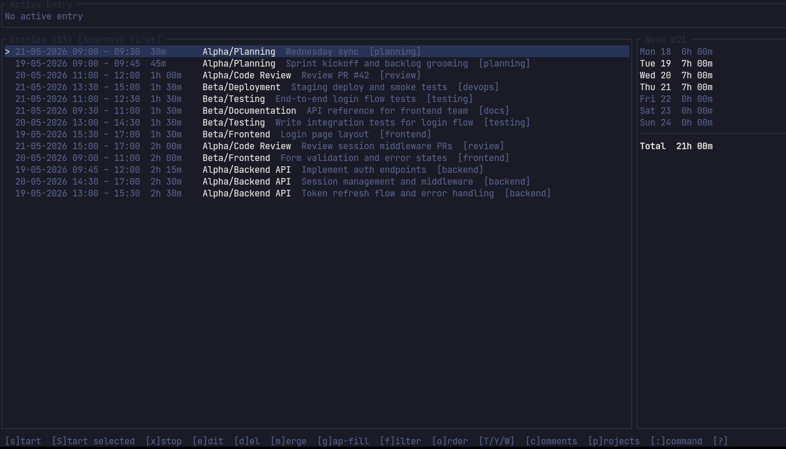

# tmkpr — Rust Time Tracking Suite

A comprehensive, fast, and offline time tracker written in Rust. Track time against projects and tasks with a focus on simplicity and cross-platform compatibility. All data is stored locally in SQLite, giving you full control over your time-tracking information.



## Features

- **Project & Task Management**: Organize your work with projects and flexible task hierarchies
- **Time Entry Logging**: Track work with start/stop timers or manually log entries
- **Entry Editing**: Modify any time entry retroactively with natural language time input
- **Reporting**: View summaries by project, daily reports, weekly breakdowns, and ISO week reports
- **Comments**: Attach free-form notes to any entry for context
- **Tagging**: Organize entries with custom tags
- **Data Portability**: Import and export entries in CSV or JSON format
- **Obsidian Integration**: Automatically log activities, comments, and project/task changes to your Obsidian vault (optional)
- **Fast & Responsive**: Built in Rust for speed and reliability
- **Offline-First**: Works completely offline, syncs to local SQLite database
- **No Cloud Required**: Your time data stays on your machine

## Interfaces

Choose the interface that best fits your workflow:

### **[tmkpr-cli](tmkpr-cli/README.md)** — Command-line tool

Full-featured CLI for time tracking. Perfect for integration with scripts, cron jobs, and text-based workflows.

**Highlights:**
- Complete command coverage for all operations
- Natural language time input ("2 hours ago", "yesterday 9am")
- Multiple output formats (table, JSON, CSV, Markdown)
- Shell completion (Bash, Zsh, Fish)
- Context-aware task handoff without time gaps
- Scripting-friendly with structured output

**Quick example:**
```bash
tmkpr project add myproject
tmkpr task add coding -p myproject
tmkpr start -p myproject -t coding -n "feature development"
tmkpr stop
tmkpr report --wweek
```

### **[tmkpr-ui](tmkpr-ui/README.md)** — Terminal dashboard

Full-featured terminal UI dashboard built with [ratatui](https://github.com/ratatui/ratatui). Great for interactive session management and real-time visibility.

**Highlights:**
- Live timer display for active entries
- Sortable/filterable entry list
- Week report sidebar
- Project and task management
- Entry editing and deletion
- Intuitive vim-style keybindings
- Quick forms with autocomplete
- Command mode (`:`) for themes, settings, and config management
- 23 built-in colour themes with live preview

**Launch:**
```bash
tmkpr-ui
tmkpr ui      # via the CLI
```

### **[tmkpr-pomodoro](tmkpr-pomodoro/README.md)** — Pomodoro timer

Integrated Pomodoro timer that automatically logs sessions to the database. Ideal for focused work sessions with built-in breaks.

**Highlights:**
- 25-minute work sessions with 5-minute breaks (configurable)
- Automatic long breaks after N sessions
- Project and task selection from database
- Audio and desktop notifications
- Pause/resume capability
- Configurable cycle settings
- In-app settings editor

**Launch:**
```bash
tmkpr-pomodoro
tmkpr pomodoro   # via the CLI
```

## Installation

### Github releases

Download the latest binary for your OS from the [Github Releases](https://github.com/ljantzen/timekeeper/releases) page. Release binaries are built with audio support enabled. If you do not want audio support, build from source (see below).

### From Source

```bash
# Install all three tools (with audio)
cargo install --path tmkpr-cli
cargo install --path tmkpr-ui
cargo install --path tmkpr-pomodoro --features audio
```

### Building

```bash
# Build all (with audio)
cargo build --release --features tmkpr-pomodoro/audio

# Build specific tool
cargo build -p tmkpr-cli --release
cargo build -p tmkpr-ui --release
cargo build -p tmkpr-pomodoro --release --features audio
```

#### Building without audio

Linux requires `libasound2-dev` to compile with audio. If you prefer a build without the audio dependency, omit `--features audio`:

```bash
# Build without audio
cargo build --release

# Install without audio
cargo install --path tmkpr-pomodoro
```

Without audio, `tmkpr-pomodoro` falls back to a terminal bell on phase transitions.

## Storage and Configuration

### Locations

- **Config file**: `~/.config/tmkpr/config.toml`
- **Database**: `~/.local/share/tmkpr/tmkpr.db`

### Override database path

Set via environment variable or command-line flag:

```bash
# Environment variable (works with all tools)
TMKPR_DB=/path/to/other.db tmkpr list
TMKPR_DB=/path/to/other.db tmkpr-ui

# Command-line flag (CLI and UI only)
tmkpr --db /path/to/other.db list
tmkpr-ui --db /path/to/other.db
```

### Override theme

```bash
# Environment variable
TMKPR_THEME=catppuccin_mocha tmkpr-ui

# Command-line flag
tmkpr-ui --theme dracula
```

### Configuration File

Edit `~/.config/tmkpr/config.toml` to customize settings:

```toml
[display]
time_format = "24h"            # "24h" (default) or "12h"
date_format = "%Y-%m-%d %H:%M"
week_start = "mon"             # mon (default), tue, wed, thu, fri, sat, sun
color = true
theme = "catppuccin_mocha"     # see Themes section below

[database]
path = "~/.local/share/tmkpr/tmkpr.db"

[pomodoro]
work_duration_minutes = 25
break_duration_minutes = 5
long_break_duration_minutes = 15
sessions_before_long_break = 4
notify_desktop = false
auto_start_break = false
```

See individual tool READMEs for complete configuration options.

### Obsidian Integration (Optional)

Automatically log your time tracking activities to your Obsidian vault. Enable this optional feature to keep your daily notes synchronized with your time entries.

**Setup:**

1. Edit `~/.config/tmkpr/config.toml` and add the `[obsidian]` section:

```toml
[obsidian]
enabled = true
vault_dir = "/path/to/your/obsidian/vault"
activity_category = "work"      # optional: category for time entries
comment_category = "notes"      # optional: category for comments
```

2. Create the vault directory if it doesn't exist and add an `obsidian-logging.yaml` config to your vault (see [obsidian-logging documentation](https://github.com/ljantzen/obsidian-logging) for details).

**What Gets Logged:**

| Event | Format | Example |
|-------|--------|---------|
| **Activity Started** | `[STARTED] project / task (duration)` | `[STARTED] Backend / Feature Dev (active)` |
| **Activity Stopped** | `[STOPPED] project / task (duration)` | `[STOPPED] Backend / Bug Fixes (2h 30m)` |
| **Activity Edited** | `[EDITED] project / task (duration)` | `[EDITED] Frontend / Review (1h 15m)` |
| **Activity Merged** | `[MERGED] project / task (duration)` | `[MERGED] Backend / Testing (45m)` |
| **Activity Deleted** | `[DELETED] project / task (duration)` | `[DELETED] Support / Call (30m)` |
| **Comment Added** | Comment entry | `Comment: Fixed the bug` |
| **Project Created** | `[CREATED] project_name` | `[CREATED] Backend API` |
| **Project Updated** | `[UPDATED] project_name` | `[UPDATED] Backend API` |
| **Project Deleted** | `[DELETED] project_name` | `[DELETED] Archived Project` |
| **Task Created** | `[CREATED] project / task` | `[CREATED] Backend / Feature Dev` |
| **Task Updated** | `[UPDATED] project / task` | `[UPDATED] Backend / Feature Dev` |
| **Task Completed** | `[COMPLETED] project / task` | `[COMPLETED] Backend / Bug Fixes` |
| **Task Deleted** | `[DELETED] project / task` | `[DELETED] Support / Call` |

**Action Types:**

Activities use these action prefixes to indicate what happened:
- `[STARTED]` — Activity started (active timer)
- `[STOPPED]` — Activity stopped (completed with duration)
- `[EDITED]` — Activity edited (retroactive logging or reactivation)
- `[COMPLETED]` — Activity marked as complete
- `[MERGED]` — Multiple activities merged into one
- `[DELETED]` — Activity deleted

Tasks and projects use similar action types:
- `[CREATED]` — New task or project created
- `[UPDATED]` — Task or project name/description changed
- `[COMPLETED]` — Task marked as complete
- `[DELETED]` — Task or project deleted

**Categories:**

- If `activity_category` is not specified, activities are logged to your vault's default section
- If `comment_category` is not specified, comments are logged to your vault's default section
- Project and task operations are always logged to the default section

**Behavior:**

- Logging is **completely optional** — disable by setting `enabled = false` or omitting the section entirely
- If the vault directory doesn't exist, logging silently fails with no error messages
- All logging is **non-blocking** and doesn't affect performance
- Works with all three tools: CLI, TUI, and Pomodoro timer
- Activity logs include project and task names when available

## Themes

`tmkpr-ui` and `tmkpr-pomodoro` ship 23 built-in colour themes:

`default`, `ayu_dark`, `catppuccin_frappe`, `catppuccin_latte`, `catppuccin_macchiato`, `catppuccin_mocha`, `cobalt`, `dracula`, `everforest`, `github_dark`, `github_light`, `gruvbox_dark`, `gruvbox_light`, `high_contrast`, `kanagawa`, `matrix`, `monokai`, `nord`, `onedark`, `rose_pine`, `solarized_dark`, `solarized_light`, `tokyonight`

Select a theme via `--theme <name>`, the `TMKPR_THEME` environment variable, or the `theme` key in `config.toml`. In the TUI you can also type `:theme <name>` and use Tab to cycle through themes with a live preview — run `:config-write` to persist the choice.

### Custom themes

Define your own theme in `config.toml` using hex colour values:

```toml
[themes.my_theme]
bg        = "#1e1e2e"
fg        = ""          # leave empty for dark themes (uses terminal default); set a hex colour for light themes
active    = "#a6e3a1"
accent    = "#cba6f7"
dim       = "#7f849c"
error     = "#f38ba8"
warning   = "#f9e2af"
selection = "#313244"
border    = "#45475a"
```

For light themes, set `fg` to a dark hex colour so text is readable against the light background:

```toml
[themes.my_light]
bg        = "#ffffff"
fg        = "#1f2328"   # dark text for light background
active    = "#0969da"
accent    = "#8250df"
dim       = "#656d76"
error     = "#cf222e"
warning   = "#9a6700"
selection = "#ddf4ff"
border    = "#d0d7de"
```

Then set `theme = "my_theme"` in `[display]`.

## Quick Start

### 1. Create a project
```bash
tmkpr project add "Client Work"
```

### 2. Add tasks to the project
```bash
tmkpr task add "Feature Development" -p "Client Work"
tmkpr task add "Bug Fixes" -p "Client Work"
```

### 3. Start tracking
```bash
# Start timing
tmkpr start -p "Client Work" -t "Feature Development"

# Do some work...

# Stop timing
tmkpr stop

# Or log directly
tmkpr log -s "9:00am" -e "11:30am" -p "Client Work" -t "Feature Development" -n "implemented auth flow"
```

### 4. View your work
```bash
# Today's entries
tmkpr list

# This week's report
tmkpr report --wweek

# All entries for a project
tmkpr list -p "Client Work"
```

### 5. Or use the interactive dashboard
```bash
# Launch the terminal UI
tmkpr-ui
```

### 6. Or work with Pomodoro sessions
```bash
# Launch the Pomodoro timer
tmkpr-pomodoro
```

## Project Structure

- **tmkpr-lib** — Shared library providing database, configuration, and core data types
- **tmkpr-cli** — Command-line interface for all operations
- **tmkpr-ui** — Terminal dashboard UI
- **tmkpr-pomodoro** — Pomodoro timer with database integration

## Architecture

See [ARCHITECTURE.md](ARCHITECTURE.md) for detailed documentation on the tmkpr-ui codebase, maintainability guide, and refactoring roadmap.

## Contributing

See [CONTRIBUTING.md](CONTRIBUTING.md) for guidelines on contributing to this project.

## License

MIT
